# EchoEF-Net: Automated Ejection Fraction Estimation from Echocardiographic Segmentation using Deep Learning and Calibration

**Author:** Khaled Mohammed Elzekarey Elrefaey, MBBS  
**Independent Researcher**  
**Target Journal:** Frontiers in Cardiovascular Medicine  
**Date:** November 2025  

---

## Overview
**EchoEF-Net** is a pipeline that uses deep learning, implemented completely in a single **Jupyter Notebook (`.ipynb`)** for the purpose of automated estimation of left-ventricular ejection fraction (LVEF) from echocardiographic segmentation using **CAMUS dataset**.  
This notebook is for training a segmentation model, computing left-ventricular ejection fractions from LV cavity contours, and then applying **calibration** to improve agreement with reference measurements.

---

## Main Results
| Stage | MAE (%) | Bias (%) | SD (%) | LoA | r | R² |
|:------|:---------|:----------|:--------|:----------------|:--:|:--:|
| Pre-calibration | 6.30 [5.54,7.07]  | 3.32 [1.98,4.60]  | 6.71  | [-9.84,16.47]  | 0.847 | 0.717 |
| Post-calibration | 4.98 [4.24,5.78] | -0.01 [-1.26,1.19] | 6.40 | [-12.55,12.54] | 0.845 | 0.714 |

> Calibration was found to reduce systematic bias and enhance clinical reliability of LVEF prediction.

---

## Notebook Contents

1. **Loading and Preprocessing Data**
   - Importing and processing **CAMUS dataset** (2-Chamber and 4-Chamber views).
   - Splitting data into training and validation sets

2. **Architecture of the Model**
   - Implementing segmentation models using **Segmentation Models PyTorch (SMP)**.
   - Supporting different encoder configurations such as ResNet and EfficientNet.
   - Loss: using Dice + Cross-Entropy.

3. **Training and Validation**
   - Showing training progress.
   - Automatically saving best model checkpoints.

4. **Computing Ejection Fraction**
   - Calculating LVEF by **Simpson’s biplane formula** using segmented LV cavities.

5. **Calibration and Evaluation**
   - Computing important metrics: MAE, Bias, SD, Limits of Agreement, Pearson’s *r*, and R².

6. **Visualization**
   - Plotting Scatter plots and Bland–Altman plots both pre and post processing and also after calibration.

---

## How to Run

### Requirements
- Python ≥ 3.9  
- Jupyter Notebook / JupyterLab  
- PyTorch ≥ 2.0  
- segmentation-models-pytorch  
- OpenCV, NumPy, Pandas, Matplotlib, SciPy  

### Steps
1. First clone the repository:
   ```bash
   git clone https://github.com/KhaledElrefaey/EchoEF-Net.git
   cd EchoEF-Net
   ```
2. Then launch the notebook:
   ```bash
   jupyter notebook EchoEF-Net.ipynb
   ```
3. After that run all cells to install dependecies and reproduce training, EF estimation, and evaluation.

---

## Output Examples

| Example | Description |
|:--|:--|
| 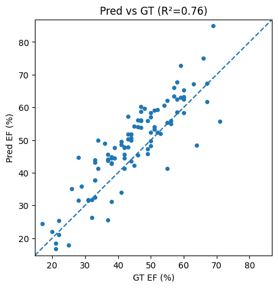 | Predicted vs. Ground Truth EF Pre-Processing|
| 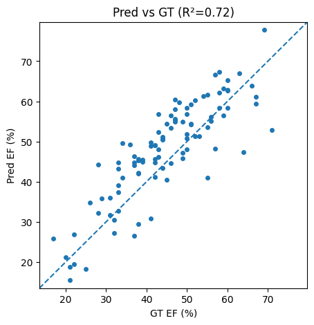 | Predicted vs. Ground Truth EF Post-Processing|
| 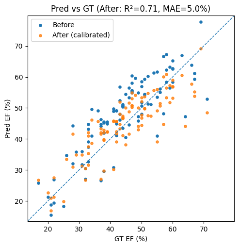 | Predicted vs. Ground Truth EF Pre- AND Post-Calibration|
| 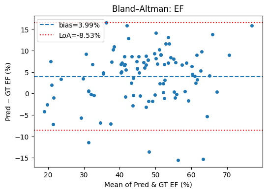 | Bland–Altman Pre-Processing |
| 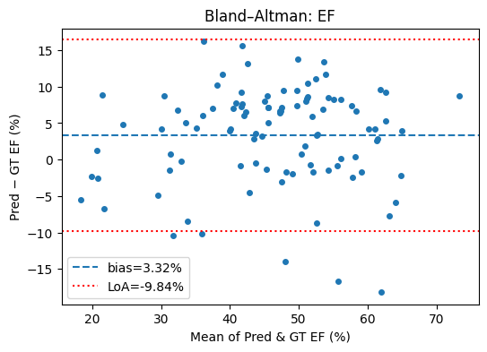 | Bland–Altman Post-Processing |
| 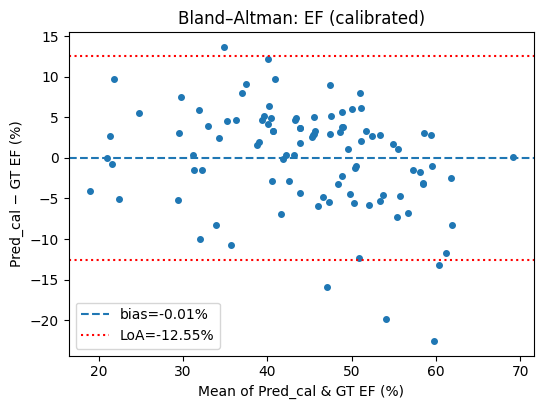 | Bland–Altman after calibration |
| 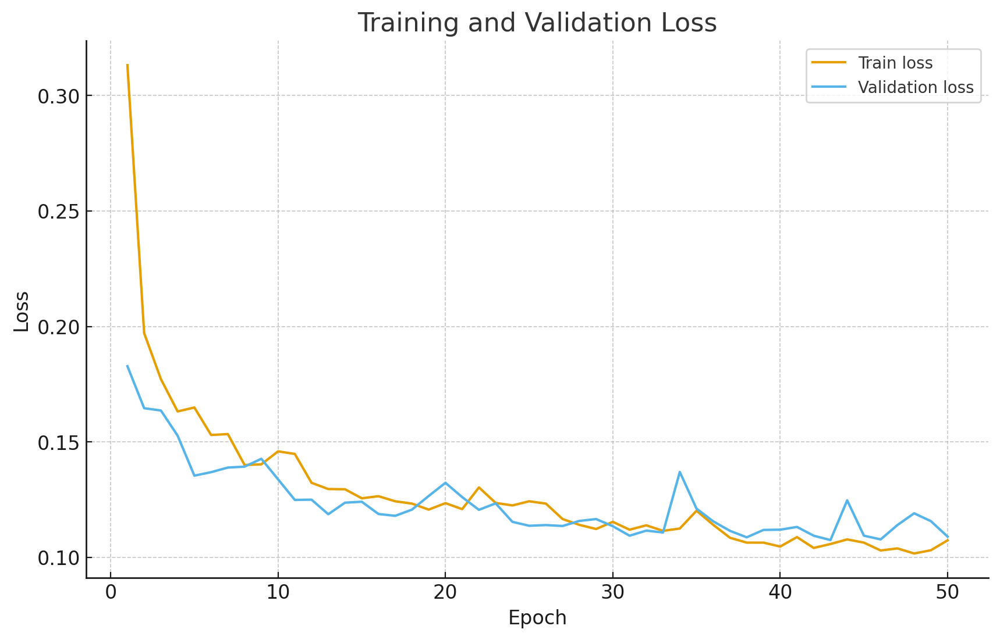 | Training and validation losses |

| LV segmentation (ED/ES frames) 2 CH and 4 CH Views (Examples) |
|:--|
| 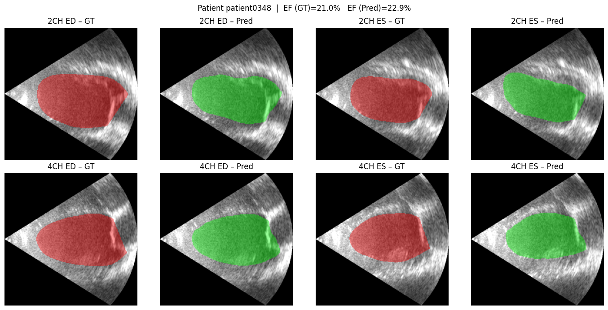 |
| 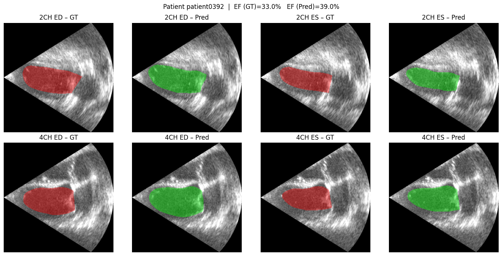 |
| 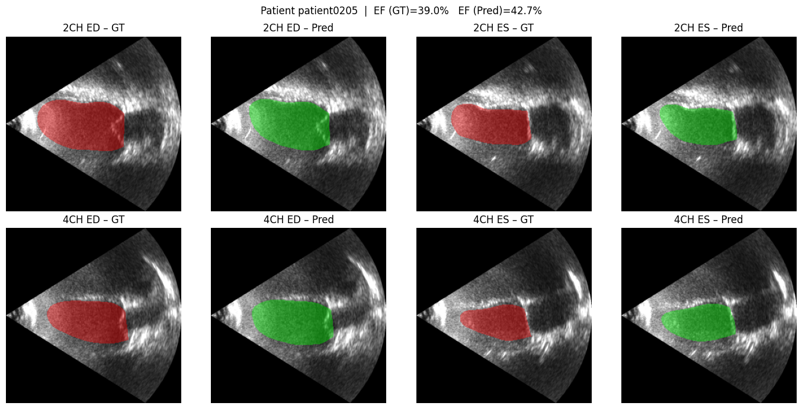 |
| 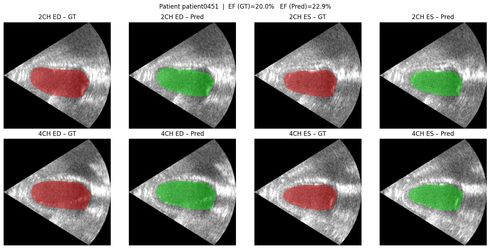 |
| 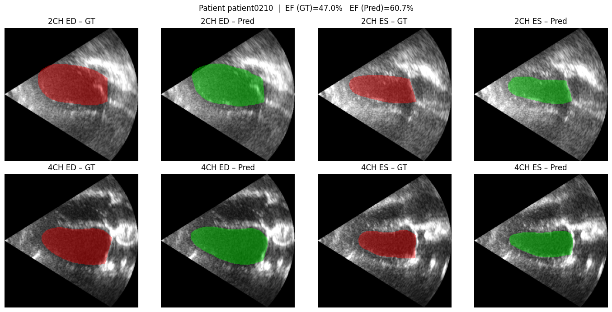 |
| 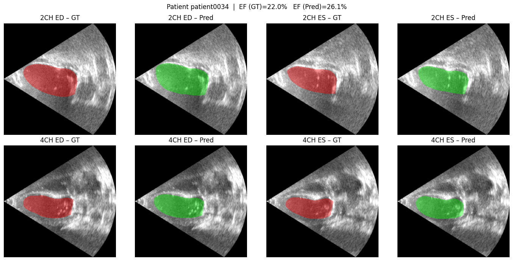 |
---

## Citation
Usin this notebook, please cite:
```
Elrefaey, K. M. E. (2025). EchoEF-Net: Automated Ejection Fraction Estimation from Echocardiographic Segmentation using Deep Learning and Calibration. *Frontiers in Cardiovascular Medicine*. Under Review.
```

---

## 📜 License
This project is released under the **MIT License**.  
Free for academic and non-commercial use with attribution.

---

## ❤️ Acknowledgments
- **CAMUS Dataset:** Leclerc et al., *Medical Image Analysis*, 2019.  
- Built with **PyTorch** and **Segmentation Models PyTorch (SMP)**.  
- Dedicated to open, reproducible AI research in echocardiography.

---
